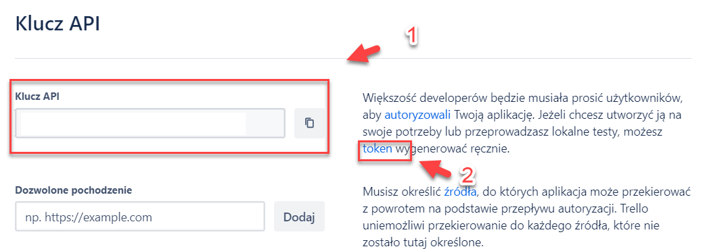

# Instrukcja Uzyskania Klucza API dla Trello

## Krok 1: Tworzenie Tymczasowego Emaila
1. Otwórz stronę [temp-mail.org](https://temp-mail.org/pl/) aby utworzyć tymczasowy adres email.
   - Alternatywnie, możesz użyć własnego adresu email.

## Krok 2: Rejestracja w Trello
1. Przejdź do strony rejestracji Trello: [Trello Sign Up](https://trello.com/pl/signup).
2. Zarejestruj się używając tymczasowego emaila lub własnego adresu.

## Krok 3: Aktywacja Konta i Nadanie Hasła
1. Sprawdź swoją skrzynkę pocztową (tymczasową lub własną) i aktywuj konto Trello poprzez link aktywacyjny.
2. Ustaw hasło dla swojego nowego konta Trello.

## Krok 4: Logowanie i Tworzenie Tablicy
1. Zaloguj się na swoje konto Trello.
2. Utwórz nową tablicę w Trello. Gdy zostaniesz zapytany o plan premium, wybierz opcję darmową.

## Krok 5: Power-Ups
1. Po stworzeniu tablicy, przejdź do strony zarządzania Power-Ups: [Trello Power-Ups Admin](https://trello.com/power-ups/admin).
2. Zaakceptuj regulamin, aby kontynuować.

## Krok 6: Tworzenie Nowego Power-Up
1. Utwórz nowy Power-Up klikając [tutaj](https://trello.com/power-ups/admin/new).
2. Wypełnij wymagane pola w formularzu.

## Krok 7: Uzyskanie Klucza API
1. Po stworzeniu Power-Up, zostaniesz przeniesiony do okna z danymi Twojego API.
2. Zapisz sobie wyświetlony klucz API w notatniku (na zdjęciu pkt nr 1)
3. Następnie wygeneruj nowy token, kliknij w 'token' oznaczony na zdjęciu numerem 2 i następnie przejdź przez cały proces aby wygenerować token.
5. Skopiuj i zapisz sobie wygenerowany token w notatniku

## Zadanie 2: Stworzenie Kolekcji Trello

Utwórz kolekcję w Postmanie na podstawie poniższych specyfikacji:

1. Otwórz aplikację Postman.
2. W lewym panelu wybierz `Collections`.
3. Kliknij `New Collection`.
4. Wpisz nazwę kolekcji: `Trello`.
5. Kliknij `Create` aby stworzyć nową kolekcję.

Instrukcje

- Kolekcja powinna zawierać żądania takie jak te, które są zdefiniowane w Twoim pliku JSON. Przykłady to `GET`, `POST`, `PUT`, `DELETE` żądania do różnych endpointów API Trello.
- Możesz ręcznie dodawać żądania klikając prawym przyciskiem myszy na kolekcję i wybierając `Add Request`.
- Pamiętaj, aby każde żądanie miało odpowiednio ustawione metody HTTP oraz endpointy.

## Zadanie 3: Stworzenie Środowiska Trello

Utwórz środowisko w Postmanie zgodnie z poniższymi specyfikacjami:

1. W Postmanie, wybierz ikonę `Environments` w lewym dolnym rogu.
2. Kliknij `Add` aby stworzyć nowe środowisko.
3. Wpisz nazwę środowiska: `Trello Environment`.
4. Dodaj następujące zmienne środowiskowe:
   - `baseUrl` z wartością `https://api.trello.com/1`
   - `key` z wartością `2f1d6341233fb95a746fbdaba8a563e0`
   - `token` z wartością `ATTAbef53bab37f477ac436a6fccdcbb6894d7b78acf832a35f4eadab9569b511985A1433556`
5. Po dodaniu zmiennych, kliknij `Add` aby zapisać środowisko.

Instrukcje

- Zmienne środowiskowe pozwalają przechowywać wartości, które mogą być często używane w różnych żądaniach, takie jak URL bazy czy klucze uwierzytelniające.
- Pamiętaj, żeby każda zmienna miała ustawione odpowiednie wartości, które odpowiadają tym z Twojego JSON-a środowiska.
- Kiedy skończysz, nie zapomnij zapisać środowiska klikając `Add` lub `Save` jeśli edytujesz istniejące środowisko.

